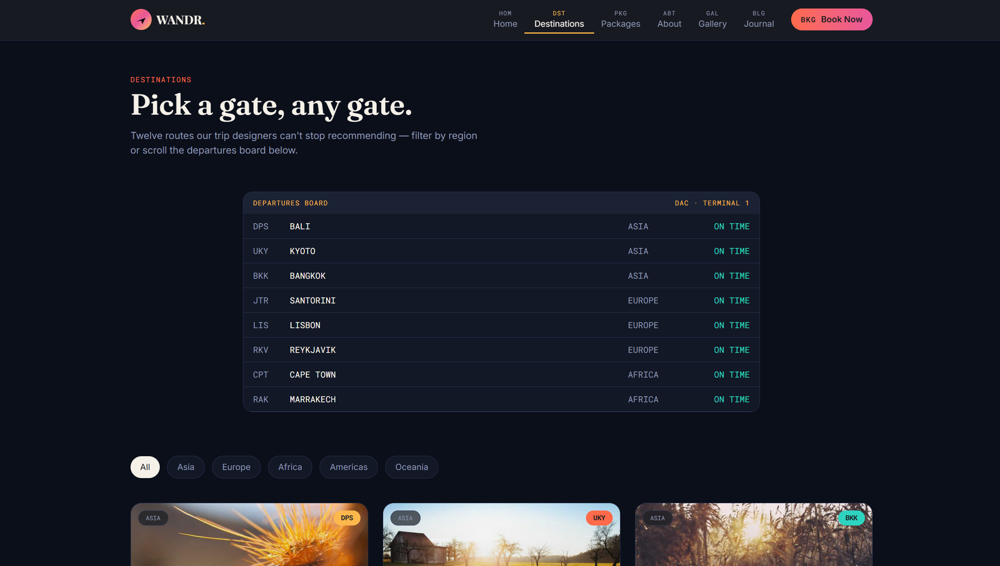
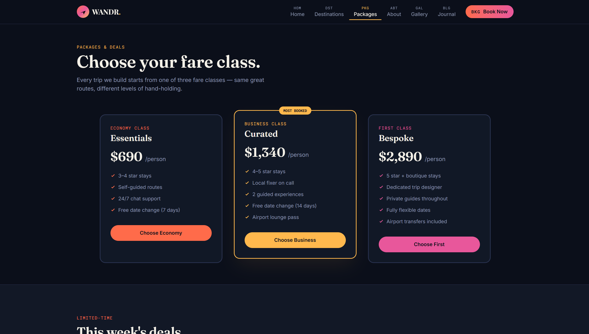
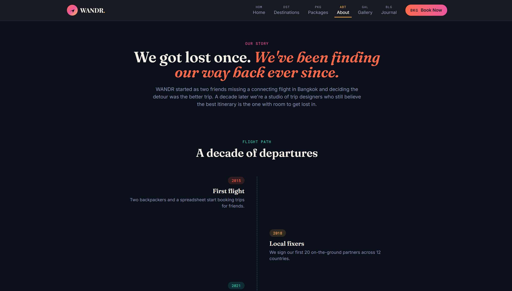
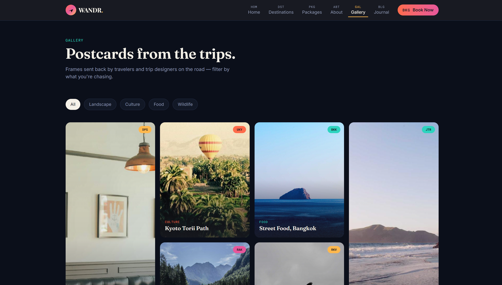
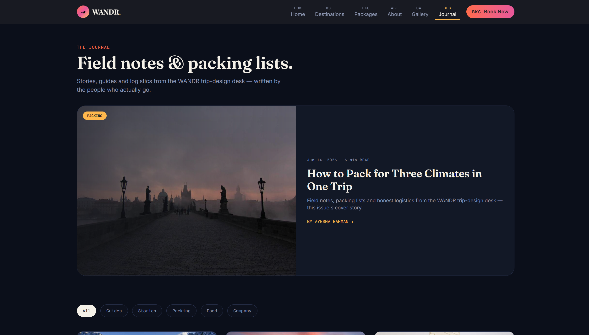
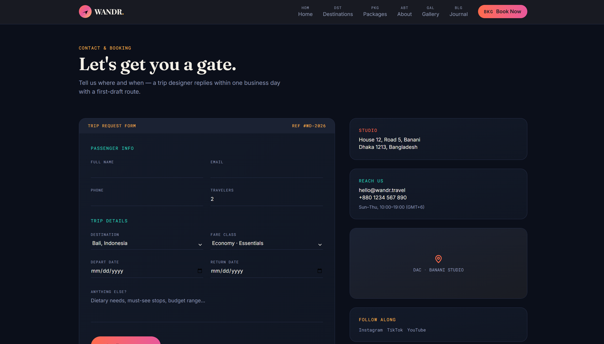

<div align="center">

<div id="travel-website"></div>

# ✈️ Travel Website


### _A Sleek, Fully Responsive Travel Website_

**Built with HTML5 · CSS3 · Tailwind CSS**

<br/>


[](https://dipu-ray.github.io/travel-website/)
[](https://github.com/dipu-ray/travel-website/issues)
[](https://github.com/dipu-ray/travel-website/issues)

<br/>


</div>

---

## 📖 Table of Contents

- [✨ About The Project](#-about-the-project)
- [🗂️ Pages Overview](#️-pages-overview)
- [🛠️ Tech Stack](#️-tech-stack)
- [🎨 Features](#-features)
- [📁 Project Structure](#-project-structure)
- [📸 Screenshots](#-screenshots)
- [🎨 Color Palette](#-color-palette)
- [👤 Author](#-author)

---

## ✨ About The Project

> _"Travel is not just visiting places. It's an experience."_

**Travel Website** is a fully responsive, multi-page digital exploration platform built entirely with **HTML5**, **CSS3**, and **Tailwind CSS**. It delivers a premium trip-planning experience, from the first glance at the dynamic destination showcase to the final sleek booking engine.

Whether you're a travel agency looking for an elegant digital storefront or a developer seeking a clean Tailwind project as inspiration, this template delivers a polished, production-ready result.

---

## 🗂️ Pages Overview

|  #  | Page                | Description                                                       |
| :-: | ------------------- | ----------------------------------------------------------------- |
| 01  | 🏠 **Home**         | Hero video banner, curated categories, trending deals & CTA       |
| 02  | 🗺️ **Destinations** | Full location listings with grid layouts, sorting, and filters    |
| 03  | 📦 **Packages**     | Detailed trip itineraries, pricing tiers, inclusions, and reviews |
| 04  | ⛰️ **About**        | Agency history, travel philosophy, core values, and team overview |
| 05  | 📸 **Gallery**      | High-resolution visual showcase, user photos, and video reels     |
| 06  | ✍️ **Journal**      | Travel guides, packing tips, destination blogs, and updates       |
| 07  | 🎫 **Book Now**     | Storefront reservation form, dynamic calculator, and checkout     |

---

## 🛠️ Tech Stack

```
Frontend
├── HTML5        → Semantic, accessible markup structure
├── CSS3         → Custom styling, smooth animations & fine-tuned typography overrides
└── Tailwind CSS → Utility-first CSS framework for rapid, custom UI development
    ├── Flexbox & Grid  → Highly responsive rows, custom columns, and layout control
    ├── Component Patterns → Custom-styled navbar, hero grids, badges, and modal sheets
    ├── Aspect Ratio & Object Fit → Seamless handling of high-resolution destination images
    ├── Arbitrary Values → Custom pixel-perfect spacing, gradients, and custom branding colors
    └── Responsive Modifiers → Breakpoint-driven styling for seamless mobile and desktop views
```

---

## 🎨 Features

### 🌟 Core Features

- ✅ **Multi-Page Architecture** — 7 fully linked, standalone HTML pages
- ✅ **Fully Responsive** — Pixel-perfect layouts powered by Tailwind's utility-first breakpoint system
- ✅ **Semantic HTML5** — Proper use of `<header>`, `<nav>`, `<main>`, `<section>`, `<footer>`
- ✅ **Tailwind Flexbox & Grid** — Highly efficient, complex modern layout control with minimal code
- ✅ **Custom Config Theme** — Extended configuration file for custom brand colors, spacing, and font sets
- ✅ **Interactive Components** — Mobile drawer menus, dropdowns, and modal dialogs using Tailwind states

### 🗺️ Page-Specific Features

- 🏠 **Hero Showcase** — Immersive video and high-resolution image banner for immediate travel desire
- 🗺️ **Destination Grid** — Advanced filter grid for sorting trips by continent, budget, and activities
- 📦 **Itinerary Overview** — Multi-day accordion breakdown with inclusion/exclusion checklists
- ⛰️ **About & Philosophy** — Responsive flex-row layouts showcasing global milestones and guide profiles
- 📸 **Visual Gallery** — Modern masonry layout with lightbox previews for user-generated content
- ✍️ **Journal Blog** — Multi-column card layout optimized for reading travel guides and packing tips
- 🎫 **Booking Engine** — Dynamic validation forms for dates, guest counts, and secure checkouts

### 🎯 Design Highlights

- 🎨 Clean, modern adventure theme with vibrant, high-contrast call-to-action layers
- 🖋️ Google Fonts — Premium, high-readability typography pairing for editorial content
- 📅 Fixed navigation header with scroll-reactive background blur effects
- 📱 Native Tailwind mobile offcanvas navigation drawer and hamburger menu
- ♿ Screen-reader friendly structures with explicit ARIA roles and labels

---

## 📁 Project Structure

```
travel-website/                     → Git repo or project name
│
├── 📄 index.html                   → Home Page
├── 📄 destinations.html            → Destinations Page
├── 📄 packages.html                → Packages Page
├── 📄 about.html                   → About Page
├── 📄 gallery.html                 → Gallery Page
├── 📄 journal.html                 → Journal Page
├── 📄 book-now.html                → Booking & Contact Page
│
├── 📁 assets/
│   ├── 📁 images/                  → All Images
│   │   ├── 📁 backgrounds/         → Background Images
│   │   ├── 📁 content/             → Pages Images
│   ├── 📁 style/                   → CSS file
│   │   ├── style.css               → Global styles & variables
│
└── 📄 README.md                 → Project Documentation & Overview
```

---

## 📸 Screenshots

<div align="center">

|                        Home Page                         |                            Destinations Page                             |
| :------------------------------------------------------: | :----------------------------------------------------------------------: |
|  |  |

|                          Packages Page                           |                        About Pages                         |
| :--------------------------------------------------------------: | :--------------------------------------------------------: |
|  |  |

|                          Gallery Page                          |                          Journal Page                          |
| :------------------------------------------------------------: | :------------------------------------------------------------: |
|  |  |

|                          Booking Page                          |
| :------------------------------------------------------------: |
|  |

</div>

---

## 🎨 Color Palette

```css
@import "tailwindcss";

@theme {
  --color-amber: #ffb84d; /* bg-amber, text-amber */
  --color-magenta: #e8579b; /* bg-magenta, text-magenta */
  --color-coral: #ff6b4a; /* bg-coral, text-coral */
  --color-ink: #1a1c23; /* bg-ink, text-ink */
  --color-cream: #f5f1e8; /* bg-cream, text-cream */
  --color-line: #2a3350; /* bg-line, text-line */
  --color-muted: #8d97b3; /* bg-muted, text-muted */
  --color-teal: #2dd4bf; /* bg-teal, text-teal */
  --color-dark: #121929; /* bg-dark, text-dark */
  --color-dark2: #0b0f1a; /* bg-dark2, text-dark2 */
  --color-dark-blue: #101624; /* bg-dark-blue, text-dark-blue */
  --color-panel: #121826; /* bg-panel, text-panel */
}
```

---

## 📐 Responsive Breakpoints

```css
@media screen and (max-width: 1024px) {
  /* Responsive for Large Tab or Small Laptop */
}

@media screen and (max-width: 360px) {
  /* Responsive for Small Phone Sizes */
}
```

---

## 👤 Author

<div align="center">

**Dipu Ray**

[](https://github.com/dipu-ray/)
[](https://www.linkedin.com/in/dipu-ray/)
[](https://dipu-ray.github.io/)

</div>

---

<div align="center">

### ⭐ Star this repo if you found it helpful!

_Made with ❤️ and a lot of ☕_

**[🔝 Back to Top](#travel-website)**

</div>
